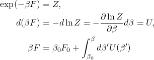
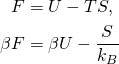
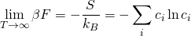

Postprocessing: Calculate the Free Energy in the Canonical Ensemble
=====================================================================

The free energy in the canonical ensemble, can be computed by the following

As the free energy is given by

it is possible to calculate the value in the high temperature limit

The strategy to calculate the free energy at an arbitrary temperature is
therefore to perform a sequence of MC simulations starting from high
temperature and cooling towards low temperatures.
Finally, the integral above can be solved numerically.

.. autoclass:: cemc.tools.CanonicalFreeEnergy
   :members:
