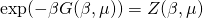
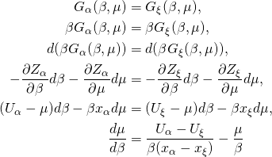

Phase Boundary Tracing
================================

In the semi grand canonical ensemble the free energy is given by

If two phases co-exist they need to have the same free energy.
We can therefore derive an equation for how the chemical potential
vary as a function of temperature on the co-existence line

By obtaining the internal energies U and the thermal averaged singlet
terms x, we can construct the co-existence line by solving the differential
equation. In the code below an adaptive forward Euler scheme is applied to
propagate the system from low to high temperatures.

.. autoclass:: cemc.tools.PhaseBoundaryTracker
   :members:
